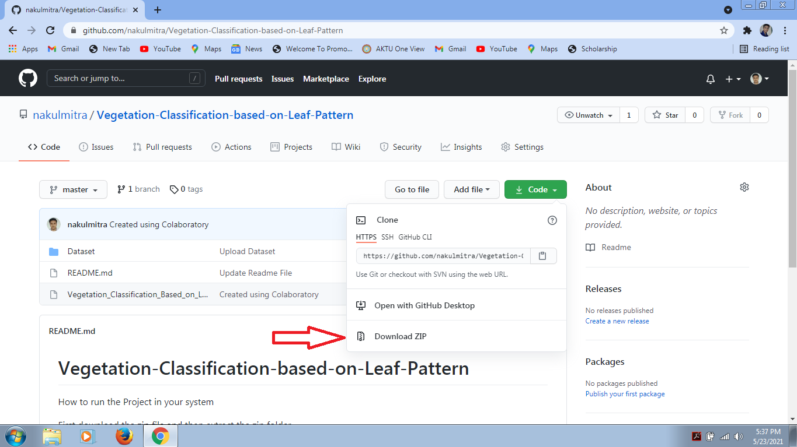
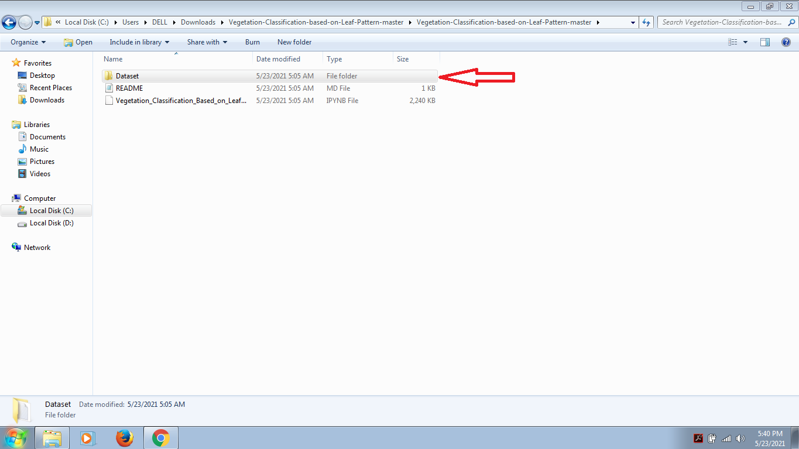
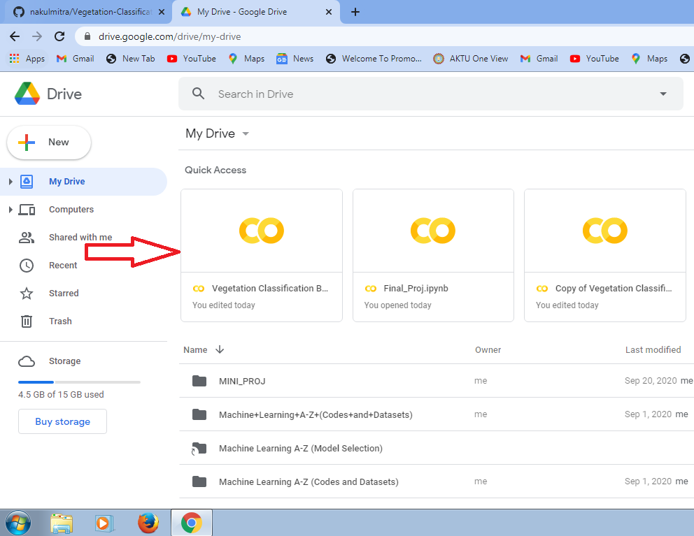
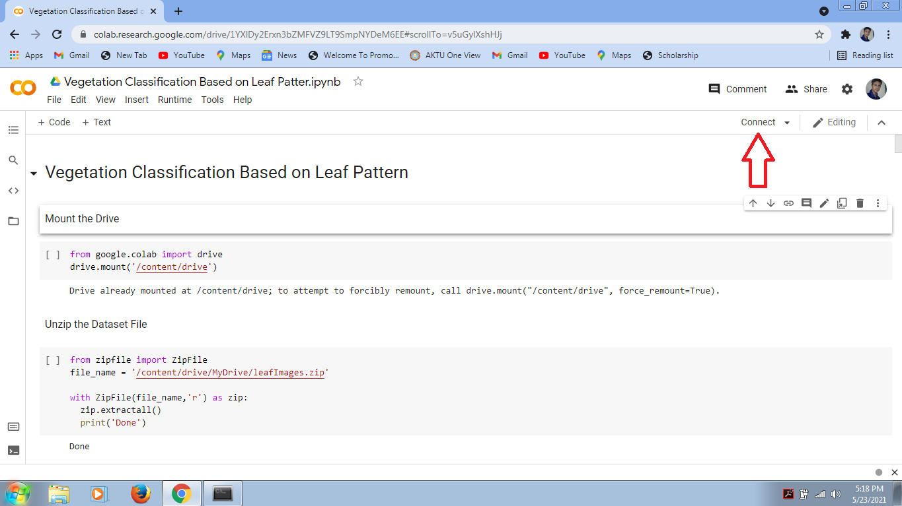
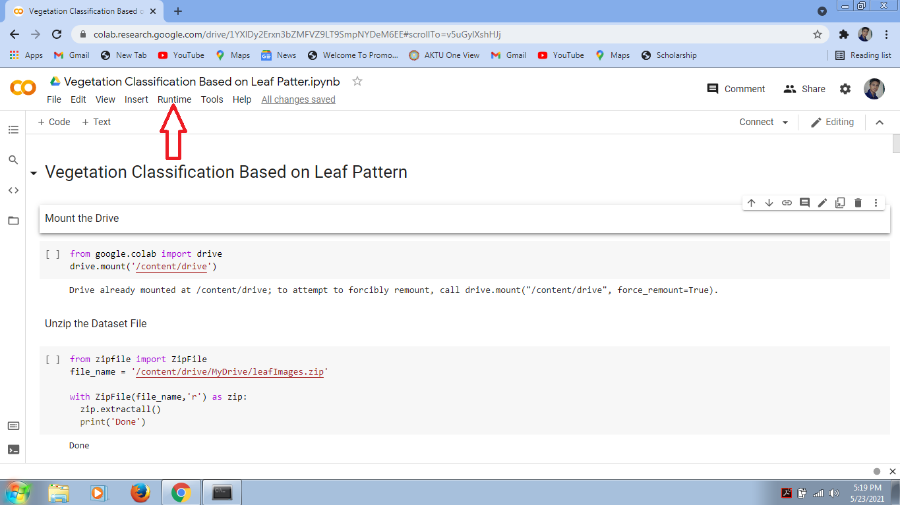

# Vegetation-Classification-based-on-Leaf-Pattern
The main purpose to build this project is to identify the class of leaf by extracting the features from it.

## How to run the Project in your system 

## Step 1: First download the zip file and then extract the zip file
Click on Code --> Download ZIP

## Step 2: Convert the Dataset folder into zip file
Select Dataset Folder --> Right Click --> Send to --> Compressed (zipped) folder

## Step 3: Upload the .ipynb and Dataset zip file into your Google Drive
New --> File upload --> select file

## Step 4: Double Click on .ipynb file. 
It will ask you to open with Google Colaboratory. Click on it. If there is no option of Google Colaboratory in your drive then you need to install Google Colaboratory

## Step 5: After you open the .ipynb file in Google Colaboratory then you first need to click on connect button

## Step 6: Click on the Runtime Button 
Runtime --> Run all

Code and Observation will be uploaded soon.
