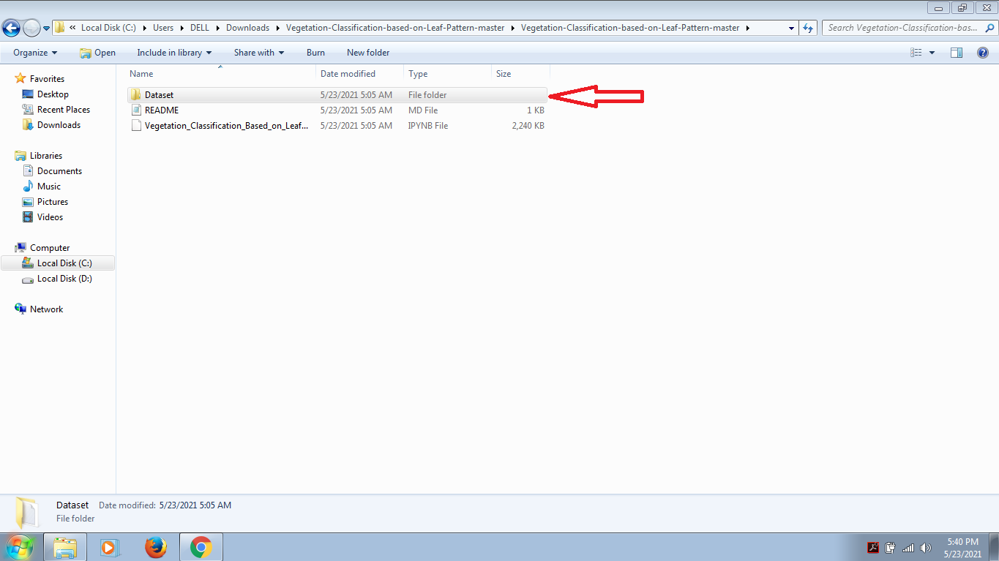
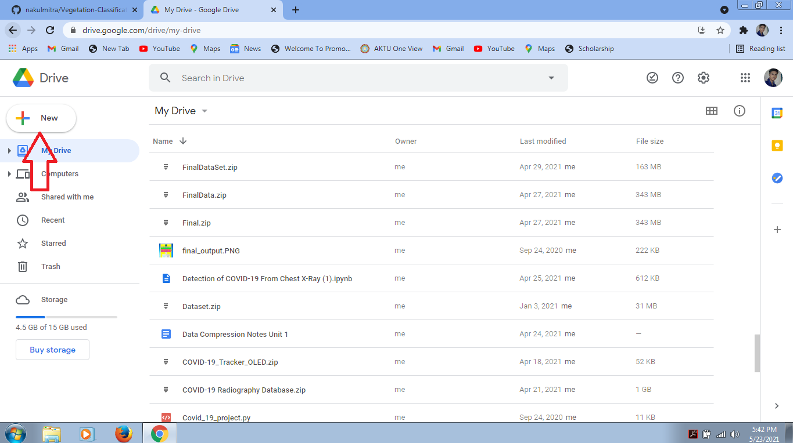
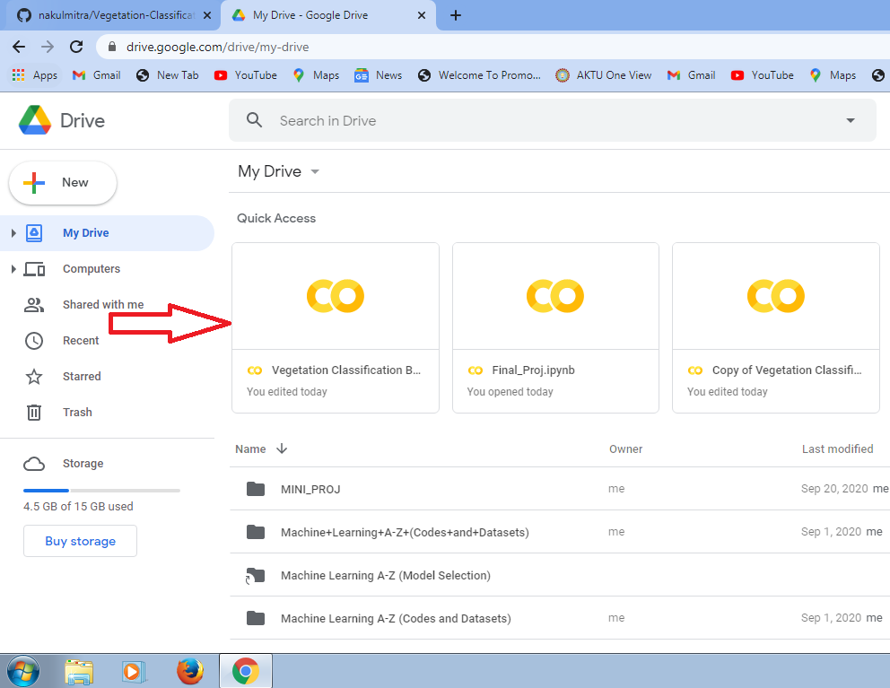
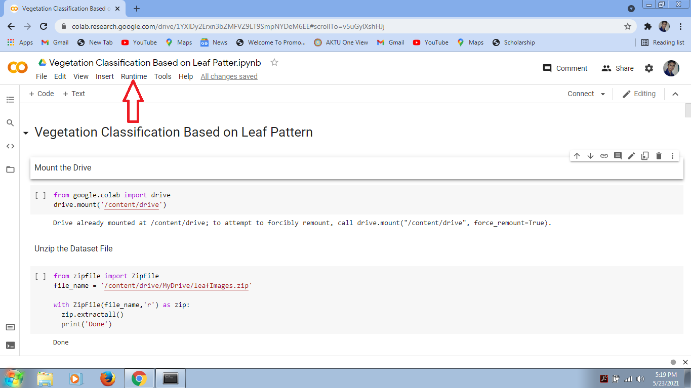

# Vegetation-Classification-based-on-Leaf-Pattern

## How to run the Project in your system 

## First download the zip file and then extract the zip folder

## Convert the Dataset folder into zip file

## Upload the .ipynb and Dataset zip file into your Google Drive

## Double Click on .ipynb file. 
It will ask you to open with Google Colaboratory. Click on it. If there is no option of Google Colaboratory in your drive then you need to install Google Colaboratory

## After you open the .ipynb file in Google Colaboratory then you first need to click on connect button

## Click on the Runtime Button 
There is a option of run all, click on it

Code and Observation will be uploaded soon.
